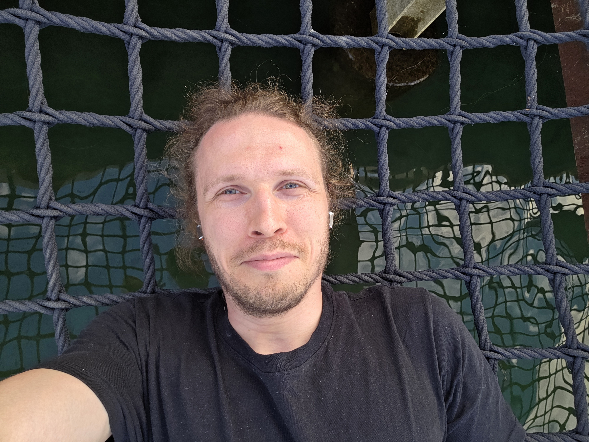

<h1>Mikhail Basok</h1>

I am currently a postdoc at Aalto University, Finland.

Previously, I was a postdoc at University of Helsinki 

and before that --- at École normale supérieure (Paris). 

 I obtained my PhD in 2021 at Steklov Institute, St. Petersburg. 

 email: m.k.basok(at)gmail.com 

<!-- Replace this div with:  -->

My research interests revolve around mathematical problems lying at the intersection of 2D statistical mechanics and conformal field theory. I started my path studying geometric aspects of moduli spaces of spin curves, to which I dedicated my PhD. I later transitioned to the study of conformal invariance in statistical mechanics: my first works were dedicated to the relation between the dimer model and isomonodromic deformations and to the asymptotic analysis of the dimer model on general Riemann surfaces, both well aligned with my geometric background. Nowadays I am working at the borderline of probability, geometry and complex analysis. I am especially interested in problems related with the dimer, uniform spanning trees and Ising models, theory of discrete complex analysis (especially t/s-embeddings), Schramm--Loewner evolution (especially on Riemann surfaces and its relation to Teichmlüler theory).

My hobbies include geometric optimisation problems (see <a href="https://arxiv.org/abs/1809.01463">here<a/> and <a href=https://arxiv.org/abs/2212.01903>here<a/>) and rock climbing.

<a href="https://orcid.org/0000-0002-1843-7425">ORCID</a>
<a href="https://scholar.google.com/citations?user=ZXLHIsoAAAAJ&amp;hl=en">Google Scholar</a>

## Selected works

[Full publication list](publications.qmd)

<section class="selected-work" aria-labelledby="paper-tau">
<h3 id="paper-tau">Tau-functions à la Dubédat and probabilities of cylindrical events for double-dimers and CLE(4)</h3>

With Dmitry Chelkak

<a class="paper-links" href="https://arxiv.org/abs/1809.00690">arXiv</a>

Short description

<!-- Replace the following paragraph with your description. -->

This work contributes to the long program of establishing the convergence of double-dimer loop ensemble (with Temperleyan boundary conditions) to CLE(4). Extending the works of Kenyon and Dubédat we prove that the probabilities of the so-called cylindrical events of the double-dimer model converge to those of CLE(4) which allows to fully characterize the scaling limit of the former, thus reducing the convergence problem to the question of tightness. The latter question remains open. 

</section>

<section class="selected-work" aria-labelledby="paper-surfaces">
<h3 id="paper-surfaces">Dimers on Riemann surfaces and compactified free field</h3>
<a class="paper-links" href="https://arxiv.org/abs/2309.14522">arXiv</a>

Short description

<!-- Replace the following paragraph with your description. -->

In this work we study the dimer model sampled on an arbitrary Riemann surface. Our results complement the earlier works of Berestycki, Laslier and Ray where the model is studied using Temperley bijection between dimers and random trees. We use a different approach based on the analysis of families of Cauchy--Riemann operators and Quillen variation formula. As a result, the scaling limit of the dimer height function is identified with a certain version of a compactified free field.

</section>

<section class="selected-work" aria-labelledby="paper-tutte">
<h3 id="paper-tutte">Harmonic functions on Tutte's embeddings and linearized Monge–Ampère equation</h3>

With Dmitry Chelkak, Benoît Laslier, and Marianna Russkikh

<a class="paper-links" href="https://arxiv.org/abs/2511.06587">arXiv</a>

Short description

<!-- Replace the following paragraph with your description. -->

The work is dedicated to the study of discrete harmonic functions on harmonic embeddings of general planar graphs lacking any particular geometri structure (as suggested by the study of random planar graphs). The main goal of this paper is to build a universal convergence result describing limits of such functions as solutions of some elliptic equations determined by the graphs. We show that these limits solve linearized Monge--Ampère equations determined by the Maxwell--Cremona lifts of the graphs. Quite surprisingly, this link between these two classical objects has been missing in the existing literature before.

</section>

<section class="selected-work" aria-labelledby="paper-kenyon">
<h3 id="paper-kenyon">Kenyon's identities for the height function and compactified free field in the dimer model</h3>
<a class="paper-links" href="https://arxiv.org/abs/2511.03804">arXiv</a>

Short description

<!-- Replace the following paragraph with your description. -->

This work is a continuation of the previous work on the dimer model on a Riemann surface. We derive a universality result which, roughly speaking, asserts that compactified free field is determined by certain bosonization identities complementing the combinatorial ideneities between the dimer height function and the inverse Kasteleyn matrix.

</section>

<section class="selected-work" aria-labelledby="paper-nesting">
<h3 id="paper-nesting">Nesting of double-dimer loops: local fluctuations and convergence to the nesting field of CLE(4)</h3>

With Konstantin Izyurov

<a class="paper-links" href="https://arxiv.org/abs/2501.01574">arXiv</a>

Short description

<!-- Replace the following paragraph with your description. -->

This work is dedicated to the double-dimer nesting fields. Given a loop ensemble, its nesting field is the function $h(x) = N(x) - \mathbb{E} N(x)$ where $N(x)$ is the number of loops surrounding $x$. Miller, Watson and Wilson defined nesting fields of CLE($\kappa$) as random generalized functions. We prove that double-dimer nesting fields converge to those of CLE(4). We also provide a local central limit theorem asserting that the properly rescaled double-dimer nesting field evaluated at a fixed point is asymptotically normally distributed (as one expects from CLE heuristics). Both results require a rather subtle analysis of discrete Cauchy--Riemann operators with monodromies.

</section>
